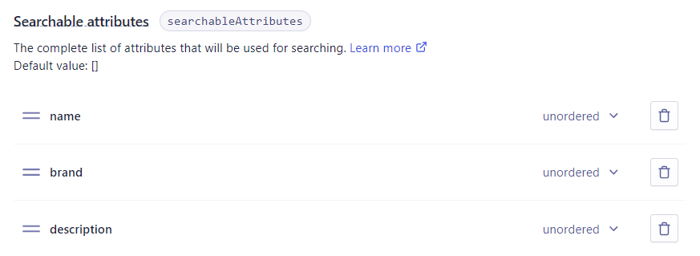
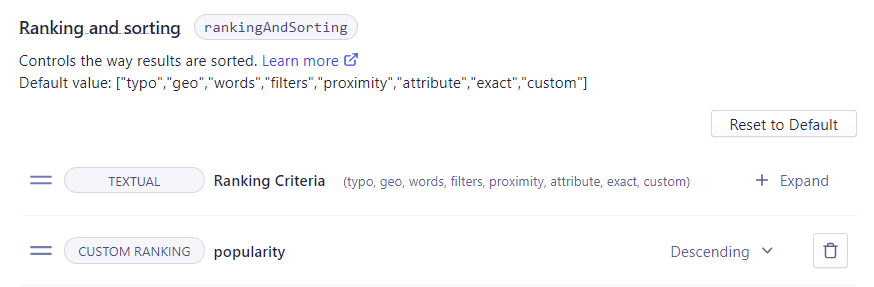

# Algozon

Algozon is a small project using algolia's instant-search library with angular and angular material.

It gives user the ability to search through an ecommerce dataset.


## [Watch Demo (2021 new version)](https://algozon.gritchou.dev)

[Watch Demo (2019 old version)](https://algolia.gritchou.dev)

[Old version github repository](https://algolia.gritchou.dev)

[Algolia](https://www.algolia.com/)

[Instant Search Documentation](https://www.algolia.com/doc/guides/building-search-ui/what-is-instantsearch/js/)

[Algolia's Angular Instant Search Library](https://github.com/algolia/angular-instantsearch)

[Angular](https://github.com/angular/angular)

[Angular Material](https://github.com/angular/material)

## Quick Install

```sh
git clone https://github.com/gritchou/algozon.git
cd algozon
npm i
npm start
```
Navigate to `http://localhost:4200/`. The app will automatically reload if you change any of the source files.

## Why?

In 2019, I decided to give a try to Algolia's instant-search library. My main goal was to use it with Angular 8 (latest Angular version at the time) and Angular Material's widgets. To build my application I used a public ecommerce dataset provided by Algolia's team.

```javascript
 config = {
	apiKey: '6be0576ff61c053d5f9a3225e2a90f76',
	appId: 'latency',
	indexName: 'instant_search',
	routing: true
};
```
This apiKey allows users to search via data that has already been indexed and therefore it is already optimized for search, but you can't interact with it nor modify the search results.
In 2021, as part of my application for the Solutions Engineer role, I came back to my project and decided to improve it in several ways:

1. Update the dependencies
2. Improve the UI
3. Upload a dataset in Algolia's Dashboard
4. Find business relevance for an ecommerce website
5. Improve user search experience

## How?

### Technical Stack

My first step was to update the dependencies. Angular latest is now `v11` and angular-instantsearch latest version is `v2.3.0` (there is a `3.0.0-beta.5` version, but I prefer to work on stable versions).

For the deployment, I am used to Netlify. It is easy for me to create subdomains there and it took me five minutes to deploy a new website from github to [algozon.gritchou.dev](https://algozon.gritchou.dev).

### Design

For this UI, I wanted to focus on a Simple, Fast and Clean interface to have the user focus on the Search. Since my Dataset was for an ecommerce website, I naturally thought about building an Amazon lookalike. I used a font and colors inspired by Amazon. I also designed a favicon mixing Algolia's colors.

### The Application

The application is single page.

Here is how it is built:

- Topbar
	- Sidebar toggle button
	- algozon Name
	- Searchbox (Custom widget extending BaseWidget)
- Sidebar
	- Category Label (Custom widget extending BaseWidget)
	- Category Widget
	- Brand Label (Custom widget extending BaseWidget)
	- Brand Widget
	- Rating Widget
	- Price slider Widget
- Main
	- Results Widget
	- Current Refinements Widget
	- List of Products represented as cards
		- Picture
		- Hightlight
		- Rating
		- Price

# The Search

## Dataset

From the [List of Algolia's Datasets](https://github.com/algolia/datasets), I chose to use this [ecommerce Dataset](https://github.com/algolia/datasets/tree/master/ecommerce) because it looked really similar to the public one I used before (it might be the same actually).

After creating an index `prod_ALGOZON`, I uploaded the Records and started to configure my index with Algolia's Dashboard.

Items in my Dataset look like this:

```javascript
  {
    "name": "3-Year Unlimited Cloud Storage Service Activation Card - Other",
    "description": "Enjoy 3 years of unlimited Cloud storage service with this activation card, which allows you to remotely access your favorite music, movies and other media via a compatible device and enables private file sharing with loved ones.",
    "brand": "Pogoplug",
    "categories": [
      "Best Buy Gift Cards",
      "Entertainment Gift Cards"
    ],
    "hierarchicalCategories": {
      "lvl0": "Best Buy Gift Cards",
      "lvl1": "Best Buy Gift Cards > Entertainment Gift Cards"
    },
    "type": "Online data backup",
    "price": 69,
    "price_range": "50 - 100",
    "image": "https://cdn-demo.algolia.com/bestbuy/1696302_sc.jpg",
    "url": "http://www.bestbuy.com/site/3-year-unlimited-cloud-storage-service-activation-card-other/1696302.p?id=1219066776306&skuId=1696302&cmp=RMX&ky=1uWSHMdQqBeVJB9cXgEke60s5EjfS6M1W",
    "free_shipping": true,
    "popularity": 10000,
    "rating": 2,
    "objectID": "1696302"
  }
```

## Index configuration

Regarding the search we can rapidly see that attributes `name`, `brand` and `description` should be added to the Searchable attributes.



Then we have to think about the ranking and sorting attributes.
From an ecommerce perspective, relevant business KPI could be: `number of sales`, `views`, `likes`, `release date`, `rating`, ... In our case one attribute that comes directly to mind is `popularity` and the second one could be `rating`. I think `rating` can be misleading because a product rated once could be rated six out of six when a product rated thousand times could have a rating of five. In this case the first result would not be the expected result. So I decided to use only the `popularity` as a custom ranking attribute.

As recommended by Algolia, I decided not to change the order of the eight criteria of the Ranking Formula.



Now I simply had to use `prod_ALGOZON`, my newly configured Index in my `app.component.ts`

```javascript
config = {
	apiKey: 'c93c9c1cd411d4b08f2f95ecc6c150ac',
	appId: 'S0QWXUZ3HE',
	indexName: 'prod_ALGOZON',
	routing: true,
};
```
## Rules Creation

I wanted to go a bit further with the Search Experience and I decided to address three use cases.

1. Use case #1: Product promotion

> Our partner Philips has a new starter kit of Philips Hue. Its price is $199.99. We have a discount on this pack but we need to promote it. We would like to rank it in first place when user search for any word of: Starter, Kit, Philips, Hue, Color. Is it possible?

I recorded a gif showing how I created this rule using the Visual Editor in the Dashboard's rule panel. It might be a bit too fast and the caption is not always easy to read. Next version will be easier to follow.


2. Use case #2: User intent

> Sometimes our user is looking for cheap products. Cheap is not a word we want to match with the searchable attributes, it is a user intent to reduce the price range. Can you filter the price below $100 when user types `cheap`?

For this rule, I used the Manual Editor.

The rule condition is:
When the query contains cheap (or plural / synonyms / typos)
The rule consequence is:
Add a Query Parameter with value:

```javascript
{
  "filters": "\"price\"<=100"
}
```

3. Use case #3: Increase ranking of a brand's products

> Our partner Samsung produced too much phones. They need to sell some as soon as possible because their stocks are costing too much. When our users look for Samsung, phones are not the first results. Can you change this?

I used the Visual Editor just like for the first use case. This time the trigger is on the word `Samsung` and I simply pinned a few Samsung phones to the first results as a Strategy.

## Next Steps?

- [x] ~~Clear Filter~~ (Done with the current refinements widget)
- [x] ~~Handle Responsive~~ (Added a toggle button to hide facets & sidenav mode is now over when on small screen)
- [ ] Accessibility
- [ ] Add a customized component when there are no results.
- [ ] Cross-browser (The page has been tested on chrome and firefox, it is important to test it at least on the other evergreen browsers)
- [ ] Write Tests
- [ ] Limit to three lines the product highlight to avoid a jump when it's too long.
- [ ] Test autocompletion
- [ ] Test A/B testing
- [ ] Redo favicon with white font color to improve contrast (accessibility)
- [ ] Redo demo gif

## Feedback

I had a great time playing with Algolia. Trying to find what relevance means for a business is really interesting.

I had some trouble with a few widgets:

- I couldn't get `ais-toggle` to work properly. I am not sure it has the expected behaviour.
- It could be easier if there was a possibility to add a label on top of some widgets such as `hierarchical menu`, `refinement list` (I had to build custom widgets just to show/hide a label when the facets are present).

It could be interesting to advertise a bit more how to create custom elements from scratch directly, but I suppose it depends on the target.

I think [this example](https://www.algolia.com/doc/api-reference/widgets/refinement-list/angular/#full-example) is not up to date: it should be attributeName line 36.

## Customer questions

My answers to the customer questions can be found [Here](https://github.com/gritchou/algozon/blob/master/docs/customer-questions.md)
